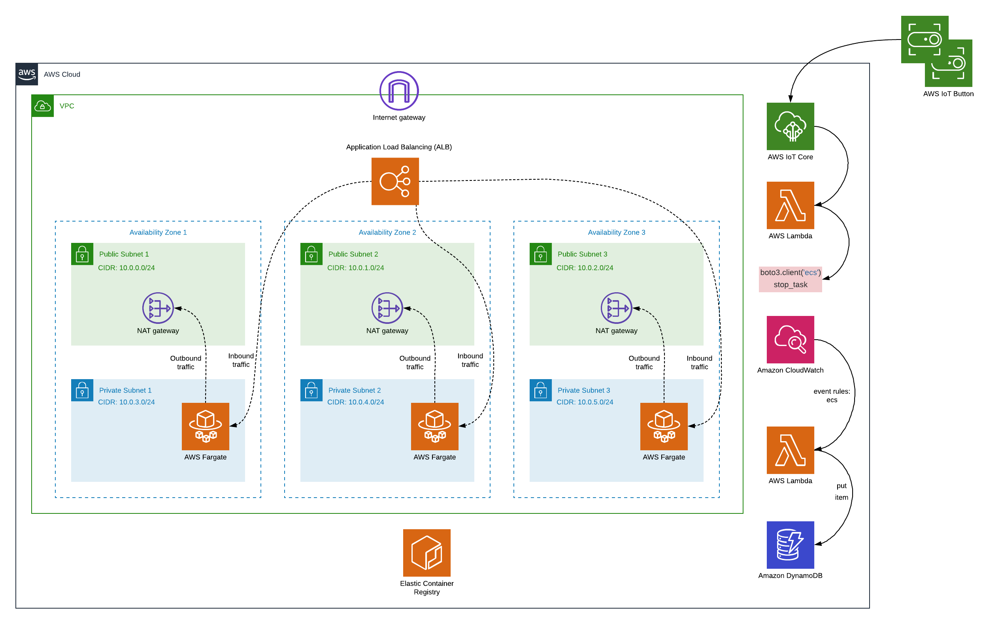
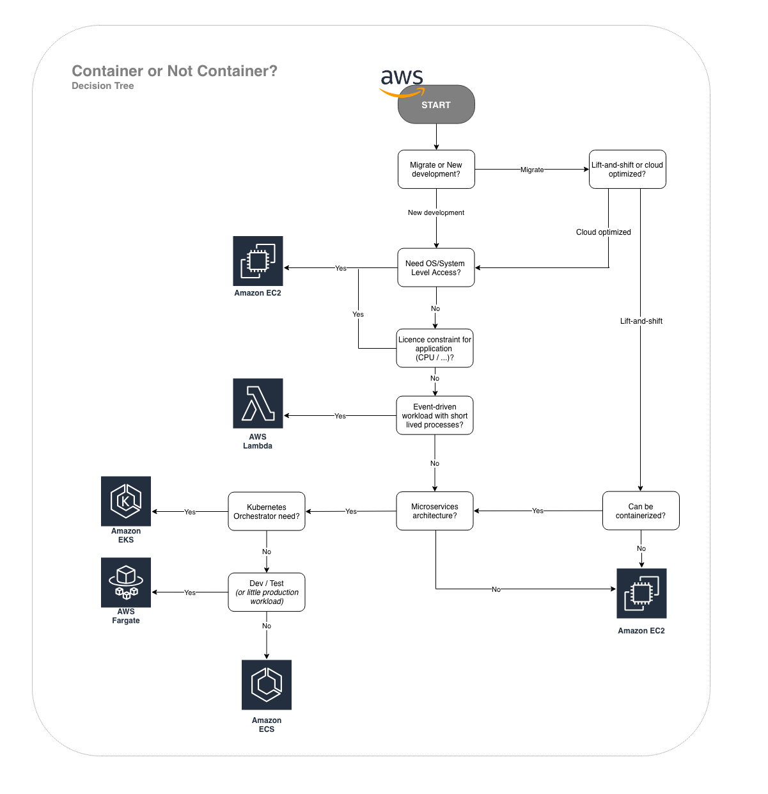

# Cloudreach - Paris Meetup 4/11/2019

> Container with Infrastructure as Code (IaC)

## Environnement and Requirements

> Logical Architecture diagram



> Requirements

* Environnement with Bash support
* AWS Cli
* AWS Account & configure with profile

## Usage

> Edit the AppBuilder.sh file and update the following variables with your information

```
aws_stack_name='This name will appear in cloudformation and will be used for resource names.'
aws_profile='Your profile in .aws/'
```

> Edit all JSON files in /parameters and replace with your informations

* parameters/ecr-repo.json
* parameters/ecs-cluster.json
* parameters/vpc-3azs.json

> Create stack

```
./AppBuilder.sh create-all-stack 
```

> Destroy stack

```
./AppBuilder.sh delete-all-stack
```

## Repository contents

```
.
├── AppBuilder.sh
├── README.md
├── app-demo
│   ├── Dockerfile
│   └── index.html
├── images
│   ├── aws-containers-decision-tree.png
│   └── logical-architecture-diagram.png
├── parameters
│   ├── ecr-repo.json
│   ├── ecs-cluster.json
│   └── vpc-3azs.json
└── templates
    ├── ecr-repo.yml
    ├── ecs.yml
    ├── event-handling.yml
    ├── fargate.yml
    ├── lambda-ecs-stop.yml
    └── vpc-3azs.yml
```

## Container or not?

